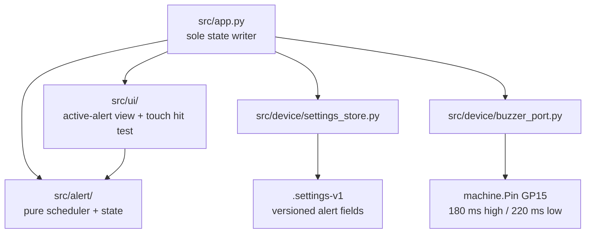

# Architecture Spine — Alert Clock

## Design Paradigm

**Functional Core / Imperative Shell.** Pure alert scheduling and state
transitions propose immutable next records. `App` is sole writer of live alert
state, commits persisted settings through `SettingsStore`, and drives UI and
buzzer ports.



## Inherited Invariants

| Inherited | From parent | Binds here |
| --- | --- | --- |
| AD-1, AD-2, AD-5, AD-7, AD-10, AD-11 | `pico-w-calendar-clock` | Pure core, App single writer, monotonic timing, bounded rendering, host/device parity, DisplayPort. |
| AD-1, AD-3, AD-4, AD-5, AD-7 | `wifi-config` | Cooperative web ownership, sole settings persistence, bounded authenticated HTTP, session auth, explicit device proof. |
| AD-2, AD-3, AD-5, AD-6, AD-9 | `touch-ui` | Polled TouchPort, SPI ownership, pure surface state, suspended dwell, fixed loop insertion point. |

## Invariants & Rules

### AD-1 — One combined active occurrence [ADOPTED]

- **Binds:** FR-4, FR-7, FR-8, FR-9; `AppState.alert_state`
- **Prevents:** concurrent active states, buzzer owners, and contradictory acknowledgement outcomes.
- **Rule:** due alerts in same local minute, or due while alert is active, join one occurrence. Stop and auto-stop resolve every joined alert; Postpone defers every joined alert to one shared due time.

### AD-2 — Persist postponed occurrence; skip overdue restart [ADOPTED]

- **Binds:** FR-8, NFR-3, boot recovery
- **Prevents:** lost valid postpones and unexpected late alarms after reboot.
- **Rule:** persist pending postponed occurrence atomically. On boot restore it only when its local due instant is still future; discard overdue state without ringing.

### AD-3 — Configuration commits govern future occurrences [ADOPTED]

- **Binds:** FR-1, FR-4, FR-7, FR-8; web settings mutations
- **Prevents:** web writes racing active touch/buzzer resolution.
- **Rule:** an active or postponed occurrence captures member alert identities at raise time and completes through Stop, Postpone, or auto-stop. Config saves affect only later due detection. After successful commit, the web/coordinator shell emits one canonical `alert_config_committed` event; App applies its supplied validated snapshot at next loop boundary. Terminal one-time disable re-reads current canonical configuration and is conditional on alert id still existing, so delete wins and no stale occurrence can recreate an alert.

### AD-4 — One versioned alert settings record

- **Binds:** FR-1, FR-2, FR-3, FR-8, NFR-3; `SettingsStore`
- **Prevents:** separate alert files, partial updates, and web/scheduler schemas drifting.
- **Rule:** `SettingsStore` remains sole persistence boundary. It migrates valid `settings_version: 1` records to an alert-capable next record version before accepting alert fields, preserving Wi-Fi/admin values; unsupported records retain existing quarantine behavior. The validated, atomically committed current record owns `alerts`, `postpone_delay_minutes`, and pending postponed occurrence. Each alert has stable id, local `hour`/`minute`, `enabled`, and weekday set (`[]` means one-time); max ten alerts. Existing Wi-Fi and admin fields remain in same record.

### AD-5 — Split civil due detection from elapsed deadlines

- **Binds:** FR-2, FR-4, FR-5, FR-9, NFR-1, NFR-2
- **Prevents:** NTP correction extending auto-stop/cadence or duplicate firing after repeated loop passes/backward clock adjustment.
- **Rule:** pure scheduler keys base due detection by `(alert_id, local_date, hour, minute)` and records each raised key for current runtime. It evaluates only when `TimeSnapshot.local` exists, never retrofires a missed base minute after boot, and uses local Device Time only for recurrence and postponed due instants. App uses wrap-safe monotonic ticks only for five-minute auto-stop, postponed-confirmation dwell, and repeating 180 ms-sound / 220 ms-silence `tut` cadence.

### AD-6 — Alert surface exclusively owns attention and resolution

- **Binds:** FR-6, FR-7, FR-8; touch and rendering
- **Prevents:** Rotation, Bar, Settings, or stale taps rendering/responding during active alert.
- **Rule:** `active-alert` is an App-owned exclusive surface, evaluated before inherited `touch_state.next_surface`; normal Bar/Settings hit testing, render, and deadlines do not run while alert is active. Pure alert hit testing maps one debounced edge to `stop` or `postpone`; duplicate edges after resolution are ignored. Postpone puts App in bounded monotonic confirmation state, then every terminal path enters Rotation and rearms normal view dwell.

### AD-7 — Buzzer is bounded adapter, not scheduler state

- **Binds:** FR-5, NFR-2, NFR-4, NFR-5
- **Prevents:** hardware imports in pure code, blocking sound, and unsafe electrical drive.
- **Rule:** pure alert logic emits desired sound state only. Main composition injects `BUZZER_SIGNAL_PIN=15`, `BUZZER_HIGH_MS=180`, `BUZZER_LOW_MS=220`, and active-high polarity into one device `BuzzerPort`; no other layer owns GPIO literals. Port construction first drives output low before exposure. App resolves Stop, Postpone, Auto-stop, and alert failure before its one bounded `tick(now, sounding)` call each loop; terminal transition calls idempotent `silence()` in same step and cannot reassert high. On sound start or re-alert, port drives high immediately, then uses wrap-safe phase deadlines for 180 ms high / 220 ms low repeating `tut` cadence; a late tick resynchronizes from `now` without replaying missed edges. Init, drive-high, drive-low, and silence return named secret-free results; a failed drive marks output unknown, attempts one best-effort low, and requires fresh low-first initialization before a later alert retry. Installed HW-508 `S`/`VCC`/`GND` pinout and audible direct 3.3 V drive are bench-confirmed and recorded in `docs/hardware_configuration.md`; measured current, polarity, and safe direct-drive validation remain required before deployment.

### AD-8 — Explicit, recoverable alert failures

- **Binds:** FR-5, FR-6, NFR-5, NFR-6
- **Prevents:** a buzzer/render exception terminating clock, web, touch, or later alerts.
- **Rule:** buzzer and alert-render adapters return named secret-free result codes. App logs `alert_fail <phase> <code>`, enters bounded alert failure presentation, silences known buzzer output, and continues cooperative loop; later occurrences retry normal activation.

## Consistency Conventions

| Concern | Convention |
| --- | --- |
| Alert domain | `src/alert/` is pure CPython/MicroPython-common-subset code; no device imports. |
| Values | Local civil fields are named records; weekday index is Monday `0`; IDs are stable lowercase strings. |
| State mutation | Scheduler returns proposed next state/action; only `App` replaces live alert state or invokes ports. |
| Persistence | Validate whole record before `SettingsStore` atomic commit; migration preserves Wi-Fi/admin settings. |
| Timing | Local wall time determines due keys; `ticks_add`/`ticks_diff` determine all elapsed intervals. |
| Evidence | Host pytest covers pure domain and fake-port low-on-init, high-first phase order, timing boundaries/late ticks, same-step terminal silence, and fault recovery; flashed-device evidence covers sound, current/polarity, recovery, touch, reboot, and Wi-Fi-off operation under `test-artifacts/alert-clock/`. |
| Diagnostics | Use `alert_*` secret-free phase/code events; host and flashed-device evidence remain separate. |

## Stack

| Name | Version |
| --- | --- |
| Raspberry Pi Pico W / RP2040 | existing physical target |
| MicroPython Pico W firmware | 1.29.0 (current stable, verified 2026-09-21) |
| Buzzer output | `machine.Pin` GP15; 180 ms high / 220 ms low `tut` cadence; electrical deployment validation still gated |

## Structural Seed

```text
src/
  alert/                 # pure Alert, Occurrence, schedule and transitions
  app.py                 # sole live-state writer and port orchestration
  ui/
    alert_view.py         # DisplayPort rendering and pure hit-test bounds
  device/
    buzzer_port.py        # direct-GPIO `tut` cadence adapter
    settings_store.py     # sole versioned alert persistence boundary
    web/                  # authenticated alert settings routes/pages
```

## Capability → Architecture Map

| Capability / Area | Lives in | Governed by |
| --- | --- | --- |
| Alert CRUD, recurrence, delay | `src/device/web/`, `src/device/settings_store.py`, `src/alert/` | AD-3, AD-4 |
| Due detection and collisions | `src/alert/`, `src/app.py` | AD-1, AD-5 |
| Sound cadence and recovery | `src/app.py`, `src/device/buzzer_port.py` | AD-5, AD-7, AD-8 |
| Active TFT and touch controls | `src/ui/alert_view.py`, `src/app.py` | AD-6, AD-8 |
| Postpone/reboot recovery | `src/alert/`, `src/device/settings_store.py` | AD-2, AD-4 |

## Deferred

- Buzzer current draw, control polarity, and whether GP15 needs a driver/buffer: before production deployment; retain documented GP15 direct-GPIO `tut` cadence unless wiring changes.
- `wifi-config` parent spine's version-1 settings statement: update it before implementation so shared persistence authority includes its versioned alert-record migration.
- User-facing buzzer/render failure wording and confirmation dwell: after target display validation.
- Alert labels, custom sounds, volume, remote triggers, and per-alert postpone duration: out of scope for this feature.
