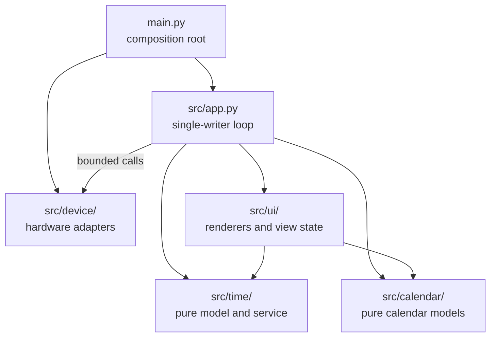
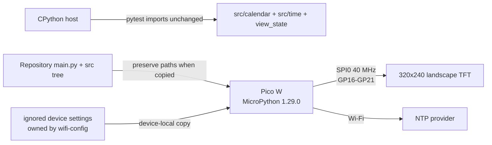

# Architecture Spine — Pi Calendar Clock

## Design Paradigm

**Functional Core / Imperative Shell.** Calendar math, local-time conversion,
time-trust rules, and view-state decisions are pure. The application loop owns
state and invokes device adapters for the RTC, Wi-Fi/NTP, and TFT. Renderers
consume snapshots; they do not read hardware or mutate application state.



## Invariants & Rules

### AD-1 — Functional core, hardware shell [ADOPTED]

- **Binds:** all firmware modules and host tests
- **Prevents:** device-only imports making calendar and view logic untestable on the host
- **Rule:** `src/calendar/`, pure modules in `src/time/`, and view-state logic must not import `machine`, `network`, `ntptime`, or device adapters. Hardware imports are confined to `src/device/` and `main.py`; values cross the boundary as ordinary Python records and results.

### AD-2 — One owner of application state

- **Binds:** orchestration, automatic view switching, time sync, and rendering
- **Prevents:** renderers, callbacks, or adapters racing to change the active view or time-trust state
- **Rule:** one single-threaded application loop exclusively commits replacements to `AppState`, including its `TimeState`, view, and deadlines. Pure services return proposed replacement values; adapters may own peripheral-local handles and reusable buffers but return results to the loop. Interrupts and background threads must not mutate product state.

### AD-3 — One time and trust authority

- **Binds:** FR-1, FR-2, FR-3, both views, and future RTC support
- **Prevents:** screens disagreeing about the current date or whether displayed time is trustworthy
- **Rule:** `AppState.time` is the sole stored trust/sync state; pure `TimeService` functions derive its replacement and an immutable `TimeSnapshot`. `ClockPort.read_utc()` and `set_utc(DateTime)` are backed by `machine.RTC`; only App calls them, marks the RTC valid after this boot's first successful NTP result, and thereafter reads its hardware-advanced value for snapshots. A `DateTime` has named `year`, `month`, `day`, `weekday`, `hour`, `minute`, and `second` integer fields. A snapshot has `utc: DateTime | None`, `local: DateTime | None`, `trust: synced | unsynced`, and `sync_age_ms: int | None`. Before validity, date-times and age are absent, Clock renders `--:--` plus the badge, and Calendar is not entered. Views and calendar logic never read RTC or NTP directly.

### AD-4 — UTC inside, Vietnam time at the domain boundary [ADOPTED]

- **Binds:** NTP sync, RTC reads/writes, local-midnight rollover, and date calculation
- **Prevents:** double-applying UTC+7 or allowing timezone changes to corrupt stored time
- **Rule:** synchronize and retain device wall-time in UTC. Pure time logic converts snapshots to fixed `Asia/Ho_Chi_Minh` time (`UTC+07:00`, no DST) before calendar or UI use. Wall-time is never used to measure elapsed duration.

### AD-5 — Monotonic scheduling

- **Binds:** one-second updates, view dwell, NTP retry, and freshness checks
- **Prevents:** NTP corrections and tick-counter wrap from skipping or extending scheduled work
- **Rule:** all deadlines use `ticks_ms`, `ticks_add`, and `ticks_diff`; durations come from checked-in configuration. Schedule another NTP attempt after every success as well as every failure. No component compares raw tick values or schedules from calendar time.

### AD-6 — Stable calendar-cell contract

- **Binds:** FR-3, Gregorian generation, calendar rendering, and future lunar/holiday enrichment
- **Prevents:** the lunar phase changing the month-grid return type and every renderer caller
- **Rule:** calendar core returns a `MonthGrid` of Monday-first, seven-cell weeks. Every `DayCell` exposes Gregorian date, `in_month`, `is_today`, and an ordered collection of semantic `CalendarAnnotation(kind, value)` records. `src/calendar/models.py` owns the allowed lowercase kebab-case kinds and their ordering; providers cannot invent kinds, and renderers own display formatting. v1 emits an empty collection. Enrichment is cached outside renderers; future solar-term work computes at most once per local date.

### AD-7 — Bounded-memory rendering [ADOPTED]

- **Binds:** TFT driver, clock renderer, calendar renderer, and continuous-operation acceptance
- **Prevents:** a roughly 150 KiB framebuffer and per-second heap churn exhausting or fragmenting RP2040 RAM
- **Rule:** render directly to the TFT using bounded dirty regions and reusable buffers. Full-view drawing is allowed on view changes; the one-second path redraws only changed clock regions and performs no recurring allocation. Do not introduce a full 320×240×16-bit framebuffer.

### AD-8 — Network failure cannot stop the clock

- **Binds:** core time sync, the render loop, error handling, and serial diagnostics
- **Prevents:** unavailable Wi-Fi/NTP freezing the display or terminating the device
- **Rule:** the cooperative `NetworkCoordinator` defined by the [Wi-Fi provisioning architecture](../../wifi-config/architecture/ARCHITECTURE-SPINE.md) owns WLAN and socket lifecycle. Core NTP behavior enters it only through that feature's typed command/event contract; each coordinator tick is bounded and never waits, sleeps, DNS-resolves, or renders. `App` alone writes RTC through `ClockPort`, reduces network results into time trust, and continues rendering after every recoverable failure. Do not call bundled `ntptime.settime()`. Wi-Fi provisioning, AP/STA transitions, HTTP, settings persistence, and credentials are owned exclusively by the Wi-Fi feature spine. Fatal handling otherwise remains limited to failures that make the TFT unusable.

### AD-9 — Wi-Fi settings stay outside product configuration

- **Binds:** deployment and repository contents
- **Prevents:** credentials entering version control or becoming importable by pure logic
- **Rule:** checked-in `src/config.py` owns non-secret pins, dimensions, colors, and durations. The [Wi-Fi provisioning architecture](../../wifi-config/architecture/ARCHITECTURE-SPINE.md) exclusively defines the ignored device-local `SettingsStore` record and migration from legacy `/secrets.py`; core modules must not import either. Missing or invalid Wi-Fi settings produce unsynced operation rather than a boot crash.

### AD-10 — Same pure code on host and device [ADOPTED]

- **Binds:** calendar, time conversion, trust policy, view-state logic, and tests
- **Prevents:** a CPython-only reimplementation masking behavior that fails on MicroPython
- **Rule:** pure production modules use the CPython/MicroPython common subset and are imported unchanged by host tests. Hardware behavior is tested through injected fakes at the adapter boundary; device-only claims require a flashed-device check by the user.

### AD-11 — One display-port contract

- **Binds:** TFT adapter, both renderers, fonts, colors, and renderer tests
- **Prevents:** renderers choosing incompatible drawing APIs, coordinates, rectangle edges, or color byte order
- **Rule:** renderers use `DisplayPort.width`, `height`, `fill_rect(x, y, width, height, color)`, `measure_text(text, font_id)`, and `draw_text(text, x, y, font_id, color)`. Coordinates are integer pixels from top-left, rectangles are clipped half-open regions, colors are RGB565 integers, and font IDs are stable configuration names. The adapter alone converts regions to inclusive controller windows and writes RGB565 high byte first; it owns SPI handles and transfer buffers. Each renderer owns its prior-value draw cache and invalidates it on view entry.

### AD-12 — App-owned view lifecycle and shared status layer [ADOPTED]

- **Binds:** both views, the unsynced badge, rotation, transitions, and local-date rollover
- **Prevents:** screens implementing different status treatment or disagreeing about when a month changes
- **Rule:** App boots to Clock and, once `TimeSnapshot.local` exists, performs plain-cut `Clock → Calendar → Clock` rotation using configurable defaults of 30s and 8s. `UiCompositor` owns previous badge visibility; when it changes, it invalidates the whole active view so the base renderer restores underlying pixels, then draws `UNSYNCED` last at the fixed top-right. Each loop reduces events in this order: consume adapter results, derive time snapshot, handle date/month rollover, handle view deadline, render base view, render status layer. A same-month date change refreshes the today highlight; a month change during Calendar dwell cuts to Clock, resets its dwell, and builds the new grid only on the next Calendar entry.

## Consistency Conventions

| Concern | Convention |
| --- | --- |
| Modules | Lowercase snake-case files; `main.py` is composition only; reusable code lives under `src/`. |
| Dates and weekdays | Gregorian tuples use `(year, month, day)` and Monday is weekday index `0`; UI formatting happens only in renderers. |
| Boundary results | Device adapters return explicit result/state values for expected failures; exceptions crossing into the loop mean programmer error or fatal device initialization. |
| State mutation | The application loop replaces snapshots/state; renderers receive read-only values and may retain only draw caches. |
| Configuration | Defaults are named constants in `src/config.py`; no behavior module embeds pins, palette values, retry periods, or dwell periods. |
| Diagnostics | Concise serial events at boot, sync outcome, view transition, and fatal initialization; no telemetry or persistent log in v1. |
| Device layout | Deploy `main.py` and the `src/` tree with their repository-relative paths preserved so imports match host tests. |
| TFT wire protocol | SPI0 mode 0 at 40 MHz; GP16–GP21 and `MADCTL 0xA8` are taken from `docs/hardware_configuration.md`. |

## Stack

| Name | Version |
| --- | --- |
| Raspberry Pi Pico W / RP2040 | Existing physical target |
| MicroPython Pico W release firmware | 1.29.0 |
| Wi-Fi provisioning/admin config | See `wifi-config` architecture spine |
| TFT adapter | ILI9341-compatible, repository-local `[ASSUMPTION]` |

## Structural Seed

```text
pi-calendar/
├── main.py                       # composition and fatal boot boundary
├── src/
│   ├── app.py                    # single-writer loop and schedules
│   ├── config.py                 # checked-in non-secret defaults
│   ├── calendar/
│   │   ├── models.py             # MonthGrid, DayCell, annotations
│   │   ├── gregorian.py          # pure v1 calculations
│   │   └── lunar.py              # deferred enrichment provider
│   ├── time/
│   │   ├── model.py              # TimeSnapshot and trust values
│   │   └── service.py            # injected clock/sync orchestration
│   ├── ui/
│   │   ├── view_state.py         # pure rotation decisions
│   │   ├── display_port.py       # drawing contract and host fake
│   │   ├── components.py         # shared UNSYNCED status layer
│   │   ├── clock_view.py         # dirty-region renderer
│   │   └── calendar_view.py      # MonthGrid renderer
│   └── device/
│       ├── display/              # SPI TFT adapter and glyph buffers
│       └── network/              # cooperative coordinator; see wifi-config spine
├── tests/                        # CPython tests for core and fake adapters
└── device-local settings          # owned by wifi-config SettingsStore, ignored
```



The physical pin map and `MADCTL 0xA8` remain owned by
`docs/hardware_configuration.md`; software must not change them independently.

## Capability → Architecture Map

| Capability / Area | Lives in | Governed by |
| --- | --- | --- |
| Core NTP sync | `src/time/service.py`, `src/device/network/` | AD-2–AD-5, AD-8; Wi-Fi feature spine |
| FR-2 seconds-level clock | `src/ui/clock_view.py` | AD-2–AD-5, AD-7, AD-11, AD-12 |
| FR-3 Gregorian month grid | `src/calendar/`, `src/ui/calendar_view.py` | AD-1, AD-3, AD-4, AD-6, AD-10 |
| Clock-dominant auto-rotation | `src/app.py`, `src/ui/view_state.py` | AD-2, AD-5, AD-12 |
| Synced/unsynced badge | `TimeSnapshot`, `src/ui/components.py` | AD-3, AD-8, AD-12 |
| Future Vietnamese lunar data | `src/calendar/lunar.py`, `DayCell.annotations` | AD-1, AD-6, AD-10 |

## Deferred

- **Controller identity:** the current code and tested orientation are ILI9341-compatible, but the physical controller was not read. Probe it before declaring the extracted display adapter final; swap only that adapter if the assumption fails.
- **Time freshness policy:** define the maximum age after a successful sync before FR-1 trust-state acceptance tests are written. `TimeService` owns the decision; views remain unchanged.
- **Wi-Fi operational proof:** AP/STA transitions, provisioning HTTP behavior, and device-local settings persistence are owned and verified by the `wifi-config` feature spine; this core spine does not re-decide them.
- **Lunar conversion strategy:** choose algorithm, table, or hybrid before v2 implementation; each option must emit the AD-6 annotation contract.
- **RTC retention:** DS3231 and its adapter remain outside v1; AD-3 and AD-4 reserve its integration boundary.
- **Alarm:** alarm and buzzer behavior remain outside v1; revisit this intended direction before unrelated product expansion.
- **Physical input:** the finalized UX supersedes the brief's button proposal, so v1 has none. A future button requires a new PRD decision, a free-pin choice, and a matching hardware-document update.
- **Display implementation detail:** font representation, controller command tables, and dirty-rectangle bookkeeping belong to the display unit unless measurements force a cross-unit rule.
- **Deployment transport:** preserve the mapped file layout regardless of whether manual copy or `mpremote` is later selected and verified on the physical device.
- **Brownfield extraction:** move the working TFT code out of `main.py` incrementally while preserving the splash baseline; do not combine extraction with controller or rendering-algorithm replacement.
- **Operational proof:** endurance, panel legibility, controller identity, and actual NTP behavior require user-run flashed-device checks; the host environment proves only pure logic and adapter contracts.
