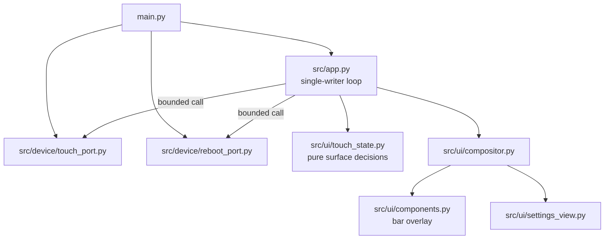
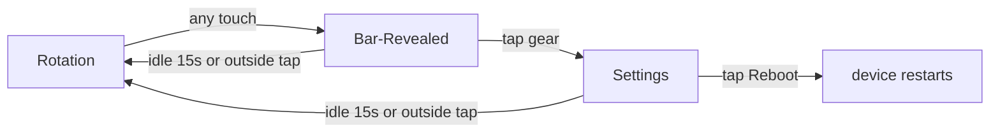

# Architecture Spine — Pi Calendar Clock — Touch UI

## Design Paradigm

**Functional Core / Imperative Shell**, extending the existing pattern rather than introducing a new one. Touch reveal/retract/timeout decisions are pure, evaluated by a new `src/ui/touch_state.py` alongside the existing `src/ui/view_state.py`. `App` remains the sole writer of product state and the sole caller of the new `TouchPort` and `RebootPort` hardware adapters.



## Inherited Invariants

| Inherited | From parent | Binds here |
| --- | --- | --- |
| AD-1 | Core clock spine | `src/ui/touch_state.py` and all pure decision code stay device-import-free; hardware imports confined to `src/device/` and `main.py`. |
| AD-2 | Core clock spine | `App` alone commits `AppState`, including its new touch-surface fields; no interrupt or adapter mutates state. |
| AD-5 | Core clock spine | Bar reveal, idle timeout, and press-flash deadlines use `ticks_ms`/`ticks_add`/`ticks_diff`, durations from `src/config.py`. |
| AD-7 | Core clock spine | Bar slide and Settings full-screen drawing use bounded dirty regions and reusable buffers; no full 320×240×16 framebuffer. |
| AD-11 | Core clock spine | Bar and Settings render exclusively through the existing `DisplayPort` contract — `fill_rect`/`draw_text`/`measure_text`, RGB565, stable font IDs. |
| AD-12 | Core clock spine | `UiCompositor` stays the sole status/overlay draw-last owner; touch UI composes through it. |
| wifi-config AD-1, AD-6 | Wi-Fi provisioning spine | `NetworkCoordinator` remains sole WLAN/HTTP owner; `App` remains sole on-screen network-status writer via `NetworkEvent` reduction — Settings reads that existing App-held state, it does not add a second path to network data (see AD-1 below for the display-clause override). |

## Invariants & Rules

### AD-1 — Settings-only network status; overlay never auto-draws

- **Binds:** FR-1, wifi-config AD-6
- **Prevents:** the always-on overlay and the new Settings view disagreeing about when network status is visible, or two code paths independently deciding to draw it
- **Rule:** `App`/`UiCompositor` stop calling `draw_network_status_overlay` from the Clock/Calendar base-view render path in every `NetworkCoordinator` mode, Setup-AP included. The `kind`/`ssid`/`ip` state `App` already reduces from `NetworkEvent`s is retained unchanged. On Settings entry, `App` copies that state once into a new `AppState.settings_status_snapshot` field; `settings_view.py` renders only `settings_status_snapshot`, never the live reduced state directly, and nothing updates that field again until the next Settings entry — this is what makes "captured at open, doesn't live-update" (UX spec) enforceable rather than incidental to render timing. This overrides wifi-config's `ARCHITECTURE-SPINE.md` AD-6 display clause ("continuously shows" / "at least 10 seconds"); that spine's AD-6 is updated by this run to drop the display rule, keeping only the event-reduction rule (see wifi-config spine).

### AD-2 — Touch crosses the hardware boundary as a polled Port

- **Binds:** FR-2, FR-3, FR-4, all touch handling
- **Prevents:** touch reads bypassing the Port convention, or a coordinator/mailbox layer being added where nothing needs to stay non-blocking across ticks
- **Rule:** `src/device/touch_port.py` defines `TouchPort` with a single synchronous `read()`, called once per `App.step()`, mirroring `ClockPort.read_utc()`. `read()` reports touch-down **edge**, not raw contact level: it returns `(edge_down: bool, x: int | None, y: int | None)`, `edge_down` true only on the first `read()` call where contact is present after a prior call with no contact — repeated calls during a held/lingering touch report `edge_down=False` until release and a new contact. Internally `read()` may take multiple raw ADC samples and reject outlier/noisy reads before returning (resistive-panel noise handling), but this stays one bounded call from `App`'s perspective — no new async machinery. `TouchPort` returns raw pixel coordinates only; it does not know about the gear or Reboot rects. Hit-testing a coordinate against a named tap-target rect (`bar_rect`/gear/reboot, from `src/ui/components.py`) is pure logic performed by `src/ui/touch_state.py`, not `TouchPort`. No queue, mailbox, or coordinator is introduced for touch.

### AD-3 — TouchPort exclusively owns the SPI0 TFT/touch handoff

- **Binds:** all touch reads, `Ili9341DisplayPort`
- **Prevents:** two adapters independently toggling chip-select on the shared SPI0 bus and corrupting an in-flight transfer
- **Rule:** around every `TouchPort.read()`, `TouchPort` alone deselects `tft_cs`, selects `touch_cs`, drops SPI0's baudrate to the XPT2046's stable rate (≤2 MHz; the TFT's 40 MHz clock is too fast for reliable touch reads), performs its transfer, restores SPI0 to `config.SPI_BAUDRATE`, deselects `touch_cs`, and reselects `tft_cs`. `Ili9341DisplayPort` never references `touch_cs` and stays unaware a touch peripheral exists.

### AD-4 — Reboot crosses the hardware boundary as a Port

- **Binds:** FR-5
- **Prevents:** `App` importing `machine` directly, breaking the boundary every other hardware crossing already respects
- **Rule:** `src/device/reboot_port.py` defines `RebootPort` with a single `reset()` method. `main.py` backs it with `machine.reset()`; host tests inject a fake that records the call instead of executing it. `App` calls `reset()` only on a Reboot tap, synchronously, with no confirmation step (per UX).

### AD-5 — One pure touch-surface state machine, one owner

- **Binds:** FR-2, FR-3, FR-4, FR-6
- **Prevents:** Bar/Settings transitions being decided ad hoc inside `App` methods, or a second place in the codebase re-deciding what surface is active
- **Rule:** `src/ui/touch_state.py` is a pure module (no device imports) mirroring `view_state.py`'s shape: functions taking an explicit current surface value plus a touch/timeout/tap-target input and returning the next surface. Valid values: `rotation`, `bar`, `settings`. `AppState` gains `active_surface` and `surface_deadline` fields; `App` alone commits their replacement (AD-2 inherited), delegating the decision to `touch_state.py`.

### AD-6 — Bar/Settings suspend Rotation's dwell timer, not extend it

- **Binds:** FR-2, FR-3, FR-6, `next_view_after_dwell`
- **Prevents:** Rotation's view-switch timer silently accumulating or firing while Bar/Settings is on screen, and disagreement about what "resume" means
- **Rule:** `App.step()` evaluates `next_view_after_dwell` (the existing Clock↔Calendar dwell check) only when `active_surface == "rotation"`. While `active_surface` is `bar` or `settings`, that check is skipped entirely — not deferred, not accumulated. On return to `rotation` (idle timeout or outside tap), the currently active Clock/Calendar view's own dwell deadline is freshly re-armed from `now`, realizing "resumes from the view it was showing" without persisting elapsed dwell time.

### AD-7 — Bar is a draw-last overlay, not a fourth view; Settings is a third view

- **Binds:** FR-2, FR-4, `UiCompositor`
- **Prevents:** the Bar being modeled as an `active_view` (implying it replaces Clock/Calendar content, which it must not) or Settings being modeled as an overlay (implying something draws underneath it, which it must not)
- **Rule:** Bar renders as a compositor-drawn overlay component (bar strip + gear glyph + press-flash) after the frozen base view, analogous to the existing UNSYNCED badge. It never becomes an `active_view`. Settings is a third `active_view` value alongside `VIEW_CLOCK`/`VIEW_CALENDAR`, rendered through the same `compositor.render()` path, since it suspends Rotation entirely and nothing draws underneath it.

### AD-8 — Shared idle timeout is one named constant

- **Binds:** FR-3, FR-6
- **Prevents:** Bar and Settings drifting to independently-tuned timeout values
- **Rule:** `src/config.py` defines a single `TOUCH_IDLE_TIMEOUT_MS = 15000`, used identically by Bar-Revealed and Settings (per the UX spec's locked Discovery decision, overriding the PRD's stated 5–8s range). `surface_deadline` is set once, on entry to `bar` or `settings`, and is never renewed mid-surface: because Bar has exactly one interactive target (gear) and Settings exactly one (Reboot), every touch while either is active either hits its one target (transitions away) or lands outside it (FR-3's outside-tap rule, which also transitions away immediately) — no touch can occur that leaves the surface active, so there is no case where "renew the timer" could apply. `touch_state.py` must not implement a renew/reset-on-touch path.

### AD-9 — Fixed loop insertion point and render call site

- **Binds:** FR-2, FR-3, FR-4, `App.step()`'s existing numbered event order (core spine AD-12), `UiCompositor`
- **Prevents:** one implementer polling touch before the network-event drain and another after (producing different answers for what a same-tick Settings-entry status snapshot captures), and Bar being drawn from two different call sites with inconsistent invalidate-before-redraw bookkeeping
- **Rule:** `App.step()` gains a new step **0**, run before the existing step 1 (`_consume_sync_result`/`_maybe_enqueue_sync`): call `TouchPort.read()`, hit-test any `edge_down` touch through `touch_state.py` against the current `active_surface`, and commit the resulting `active_surface`/`surface_deadline` (and, on Settings entry, the AD-1 status snapshot) before any other step runs. Steps 1–6 are otherwise unchanged in order, but step 4 (view deadline) is gated by AD-6. Bar overlay drawing has exactly one call site: inside `UiCompositor.render()`, after the base view and before/alongside the UNSYNCED badge — never a second, independent call from `App._render()`. `UiCompositor` invalidates the Bar's own prior draw region the same way it already invalidates on badge visibility change.

## Consistency Conventions

| Concern | Convention |
| --- | --- |
| Surface naming | `active_surface` values are the lowercase strings `rotation`, `bar`, `settings` — same casing convention as `VIEW_CLOCK`/`VIEW_CALENDAR`. |
| New config constants | `TOUCH_IDLE_TIMEOUT_MS`, bar slide duration/frame pacing, tap-target rect sizes, and Press Flash duration are named constants in `src/config.py`; no touch module embeds a literal duration or pixel rect. |
| Hardware crossings | Every new hardware capability (touch, reboot) gets its own Port object with a minimal method set, matching `ClockPort`/`DisplayPort` — no bare `machine`/`network` import outside `src/device/` and `main.py`. |
| Tap targets | Gear icon and Reboot button hit-test rects are sized for fingertip contact per the UX Accessibility Floor, distinct from (larger than) their drawn glyph/text bounds; both live as named rects alongside the existing `badge_rect` helper in `src/ui/components.py`. |

## Stack

| Name | Version |
| --- | --- |
| Raspberry Pi Pico W / RP2040 | Existing physical target |
| MicroPython Pico W release firmware | 1.29.0 |
| XPT2046-compatible touch controller | Repository-local `[ASSUMPTION]`, shares SPI0 with the existing ILI9341 |

## Structural Seed

```text
src/
├── app.py                          # + active_surface/surface_deadline/settings_status_snapshot in AppState
├── config.py                       # + TOUCH_IDLE_TIMEOUT_MS, bar/tap-target constants
├── device/
│   ├── touch_port.py                # TouchPort: polled read(), owns SPI0 CS handoff
│   └── reboot_port.py                # RebootPort: reset()
└── ui/
    ├── touch_state.py               # pure rotation/bar/settings transitions
    ├── settings_view.py             # third active_view renderer (status+guideline+reboot)
    ├── compositor.py                 # + bar overlay draw-last, drops auto network overlay
    └── components.py                 # + bar_rect/gear tap target/reboot tap target helpers
tests/                                # + fake TouchPort, fake RebootPort, touch_state unit tests
```



## Capability → Architecture Map

| Capability / Area | Lives in | Governed by |
| --- | --- | --- |
| FR-1 hide always-on overlay | `src/ui/compositor.py` | AD-1 |
| FR-2, FR-3 Bar reveal/retract | `src/ui/touch_state.py`, `src/device/touch_port.py`, `src/ui/components.py` | AD-2, AD-3, AD-5, AD-6, AD-7, AD-9 |
| FR-4 Settings view | `src/ui/settings_view.py`, `src/app.py` | AD-1, AD-5, AD-6, AD-7, AD-9 |
| FR-5 Reboot | `src/device/reboot_port.py`, `src/ui/settings_view.py` | AD-4 |
| FR-6 shared idle timeout | `src/config.py`, `src/ui/touch_state.py` | AD-8 |

## Deferred

- **Touch debounce / palm-rejection:** PRD §8 flags this as an owner-less open risk. `TouchPort.read()` performs only per-call outlier rejection (AD-2); no cross-call debounce invariant is added here. Revisit before shipping if false Bar-reveals prove real on hardware.
- **`TOUCH_IRQ` (GP26):** wired and already a named `config.py` constant, but AD-2's poll-only design (one `TouchPort.read()` per `App.step()`) does not use it. Left unused rather than removed, in case a future revision gates polling frequency on the interrupt line; using it is a new decision, not assumed here.
- **UNSYNCED badge during Settings:** neither PRD nor UX spec calls for suppressing it. Default behavior is unchanged from AD-12 (badge draws whenever `trust == unsynced`, regardless of active view) unless a future decision says otherwise.
- **Bar slide animation pacing:** rendered as incremental `fill_rect` steps of the bar strip's y-position on a tighter animation sub-tick, per AD-7's bounded dirty-region technique — but exact frame count/cadence and whether the ILI9341 fill rate holds a stutter-free ~200–300ms slide is unverified, per the PRD's own flagged NFR assumption. Requires on-device profiling.
- **Touch controller identity:** XPT2046-compatible per `src/config.py`'s existing comment, not read from hardware. Probe before declaring `TouchPort`'s wire protocol final, same caveat the core spine already carries for the ILI9341.
- **Tap target pixel sizes:** the UX Accessibility Floor requires generous fingertip targets larger than the glyph; exact rect dimensions for the gear icon and Reboot button are implementation detail, not fixed here.
