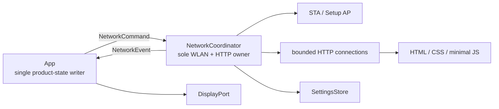
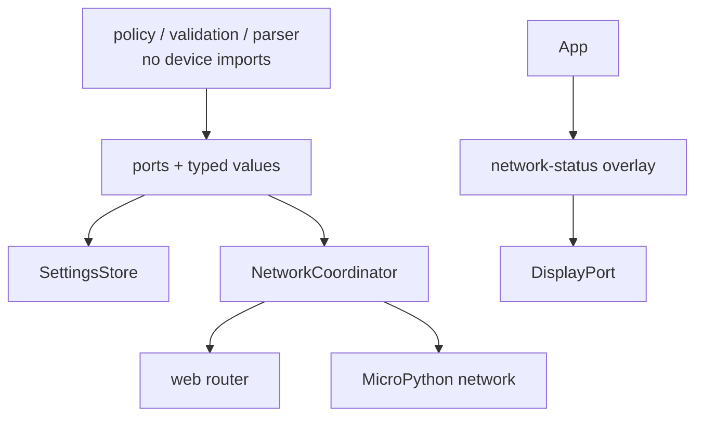
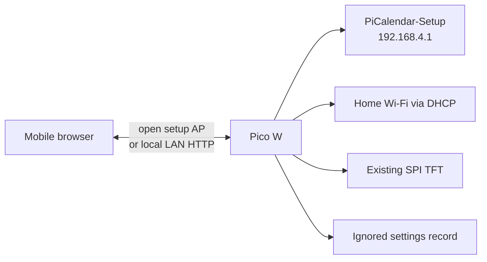

# Architecture Spine — Wi-Fi Provisioning & Admin Config

## Authority

This is the authoritative spine for Wi-Fi provisioning, local HTTP configuration,
credentials/settings, and WLAN ownership. The core clock spine references this
one for those concerns and retains only its generic time/render integration
constraints.

## Design Paradigm

**Functional Core / Imperative Shell, with a cooperative network reactor.**
Provisioning policy, settings validation, password verification, HTTP parsing,
and page decisions are host-testable core code. One device-network coordinator
owns the Pico WLAN interfaces and non-blocking HTTP sockets. `App` remains the
single product-state and TFT-status writer.



## Inherited Invariants

| Inherited | From parent | Binds here |
| --- | --- | --- |
| AD-1 | Core clock spine | Provisioning domain, HTTP parsing, and view decisions remain device-import-free. |
| AD-2, AD-3, AD-5 | Core clock spine | `App` alone changes product state, RTC/time trust, and schedules. |
| AD-8 | Core clock spine | Network work cannot block or terminate rendering. |
| AD-9, AD-10 | Core clock spine | Secrets remain untracked; shared production core runs unchanged in CPython tests. |
| AD-11, AD-12 | Core clock spine | Only the established display contract draws TFT status; App owns its lifecycle. |

## Invariants & Rules

### AD-1 — One cooperative owner for all Wi-Fi and HTTP [ADOPTED]

- **Binds:** FR-1, FR-2, existing `src/device/network/`, web serving
- **Prevents:** competing STA/AP handles, a blocking server freezing the clock, or web code drawing the TFT
- **Rule:** `NetworkCoordinator` is the sole owner of `network.WLAN`, listening/client sockets, and their lifecycle. `main.py` calls its bounded `tick()` once per loop; each tick may accept, read, write, or advance one connection step, never sleep, wait, DNS-resolve, or render. It emits typed `NetworkEvent` values to `App`; no HTTP handler, socket callback, or WLAN adapter mutates `AppState` or the display.

### AD-2 — Explicit provisioning state machine

- **Binds:** UJ-1, UJ-2, FR-1, status and setup routes
- **Prevents:** saved credentials being overwritten by a failed join, unknown AP/STA coexistence, or an unbounded reconnect loop
- **Rule:** the coordinator owns the closed modes `BOOT`, `STATION_CONNECTING`, `STATION_ONLINE`, and `SETUP_AP`. Boot validates the complete persisted record; an absent/invalid record enters `SETUP_AP`. A station attempt has a 15-second `ticks_ms` deadline; three consecutive terminal failures enter `SETUP_AP`. In setup mode, activate the open AP with SSID `PiCalendar-Setup`, display and serve the configured gateway `192.168.4.1`, and scan only through the STA interface. A setup `POST` creates the one allowed pending candidate and returns `Connecting…`; its requesting connection receives the terminal success/failure response before it is closed. The AP stays available through that response while the STA join is attempted. On join success, persist the candidate before emitting a successful station event; then flush the response, close clients, and deactivate the AP. If the commit fails, disconnect the candidate STA, emit a named persistence failure, keep the AP/form retry route active, and do not reset the failure count or emit an online/IP event. On join failure, keep the AP and form retry route active without persisting. This requires a flashed-target proof that STA association can progress while the AP serves this bounded response; if it cannot, the UX success/failure-in-browser requirement is blocked rather than silently changed.

### AD-3 — SettingsStore is the sole secret persistence boundary

- **Binds:** FR-1, FR-3, FR-4, deployment, reset/error recovery
- **Prevents:** split-brain credential files, partially saved state, raw admin passwords, or secrets leaking into logs and pages
- **Rule:** only `src/device/settings_store.py` reads or writes the ignored device-local settings record. It accepts only canonical JSON object `settings_version: 1` with `wifi_ssid` and `wifi_password` as UTF-8 strings (SSID encoded length 1–32; password encoded length 8–63, no NUL), `admin_verifier_version: "pbkdf2-sha256-v1"`, lowercase hexadecimal `admin_salt` (32 characters) and `admin_verifier` (64 characters), and `color_scheme: "forest-amber"`; unknown, malformed, or unsupported records are preserved and treated as unconfigured. `admin_verifier_version` is PBKDF2-HMAC-SHA256, 20,000 iterations, a 16-byte `os.urandom` salt, and a 32-byte derived verifier. The coordinator owns at most one `KdfJob` (correlation ID, purpose, password bytearray, salt, PBKDF2 state); the router dispatches it then drops its parsed form/body, while a concurrent request receives fixed `503 Busy`. It runs at most 200 total PBKDF2 rounds per coordinator tick, overwrites and discards the password bytearray on every terminal outcome, and emits the correlated `VERIFY_OK`, `VERIFY_REJECTED`, `VERIFY_INVALID_RECORD`, `VERIFY_CANCELLED`, or `VERIFY_FAILED` result. It uses a constant-time byte comparison. Commit writes and closes `.settings-v1.tmp`, calls `os.sync()` where available, removes a stale `.settings-v1.bak`, renames the valid current record to `.settings-v1.bak`, renames the temp record to the current record, then syncs again. At boot, a valid current record wins. If the current record is absent, a valid backup is restored; if it is invalid but a backup is valid, rename the invalid current record to the empty-only `.settings-v1.rejected` quarantine, then restore the backup. If quarantine already exists, preserve both records and enter setup mode. It never returns or logs an admin plaintext password. `src/config.py`, HTML, serial diagnostics, and pure modules contain no Wi-Fi or admin secret.
- **Native KDF gate:** the active spike uses a compiled native PBKDF2-HMAC-SHA256 primitive (native `.mpy` or C-backed firmware module) with 500 rounds. Its verifier version must be distinct from the existing 20,000-round `pbkdf2-sha256-v1` records, with an explicit migration/re-provisioning path before deployment. The stock MicroPython 1.20 image lacks `hashlib.pbkdf2_hmac`; do not deploy plaintext or custom unsalted SHA chains.

### AD-4 — Small, bounded local HTTP contract

- **Binds:** FR-1, FR-3, FR-4, UX pages, memory budget
- **Prevents:** independently-built handlers accepting incompatible forms, unbounded request memory, or a web framework dependency exceeding device constraints
- **Rule:** `src/device/web/` owns one allowlisted router, incrementally parses HTTP/1.0 and HTTP/1.1 requests, and accepts only `GET` and `application/x-www-form-urlencoded` `POST` routes defined by its route table. The setup `POST` maps one validated `{ssid, wifi_password, admin_password}` form into the coordinator's sole pending candidate; its terminal result maps back to that request connection. It enforces checked-in limits for request line, headers, body, active clients, pending candidates, and per-tick bytes; malformed, oversized, or unsupported requests receive a fixed error then close. Pages are fixed local assets/templates with explicit HTML escaping and no external fetches, package dependencies, or SPA build step. Setup routes exist only in `SETUP_AP`; login/settings routes exist only in `STATION_ONLINE`.

### AD-5 — Single-admin, volatile-session authentication

- **Binds:** FR-3, password change, config route guards
- **Prevents:** multiple incompatible login states, a password surviving in a cookie, or stale sessions continuing after a credential change
- **Rule:** the store holds one salted one-way verifier, not the admin password. The auth service verifies submitted passwords with AD-3's constant-time verifier. A successful login creates one opaque 16-byte `os.urandom` session ID, encoded as unpadded base64url (exactly 22 ASCII characters), in an in-memory table of at most four sessions. It removes entries whose deadline satisfies `ticks_diff(now, deadline) >= 0`; a successful authenticated protected request alone renews the entry to `ticks_add(now, 900000)`. Invalid, expired, malformed, or unknown cookies are cleared with `Max-Age=0` and redirected to login; a valid new login when the post-expiry table is full returns `503 Busy` with a fixed body and no cookie. Session IDs must first match `[A-Za-z0-9_-]{22}` exactly, then translate and pad for decoding; decoded IDs use bytewise constant-time comparison. Its session cookie has no persistence attribute and is `HttpOnly`, `SameSite=Strict`, and `Path=/`. All config routes require that session. A password change derives a candidate, atomically commits it, then in one terminal coordinator transition invalidates all sessions except the acting ID and renews that ID for 15 minutes; any derivation or commit failure leaves the old verifier and every session unchanged. No persistent login, username, logout route, recovery route, TLS, or remote/WAN exposure exists in v1; HTTP is an accepted local-LAN/open-setup-AP security boundary.

### AD-6 — App owns on-screen network status

- **Binds:** FR-2, UJ-1, UJ-2, existing clock/calendar rendering
- **Prevents:** network code competing with renderers or status disappearing before it is usable
- **Rule:** `App` reduces `NetworkEvent` values into network-status state and supplies it to `UiCompositor`, the parent AD-12 sole overlay owner. In `SETUP_AP`, that overlay continuously shows `PiCalendar-Setup` and `192.168.4.1`; on every successful station connection or reconnection it shows the assigned IPv4 address for at least 10 seconds. Web request outcomes can produce serial diagnostics and events only, never display calls.

### AD-7 — Host proof first; hardware proof is explicit

- **Binds:** all feature modules and acceptance testing
- **Prevents:** device imports collapsing CPython tests or host tests being misreported as AP/server proof
- **Rule:** domain policy, settings validation, verifier logic, HTTP parsing/routing, and transition rules run unchanged under CPython. WLAN, socket, filesystem, tick clock, entropy, and TFT-status boundaries are injected fakes in host tests. AP address, STA/AP transitions, scan behavior, socket fairness, flash replacement semantics, and physical display legibility require a flashed Pico W evidence run; device results are not inferred from host tests.



## Consistency Conventions

| Concern | Convention |
| --- | --- |
| Commands and events | Immutable lowercase-snake-case records: commands travel App → coordinator; events travel coordinator → App. Expected outcomes use named codes, not exceptions. |
| Time and retries | All deadlines and the three-failure count are coordinator-owned; use `ticks_ms` helpers, never wall time. A completed setup join resets the failure count. |
| SSIDs | WLAN scan bytes decode with a documented replacement policy; UI deduplicates by decoded SSID and never displays a password or BSSID. |
| Web UI | UX documents own visible content/tokens; `src/device/web/` owns transport, route protection, escaping, the one setup-candidate handshake, and form-to-command mapping. |
| Diagnostics | Emit mode transitions and named failure codes only. Never log cookies, Wi-Fi passwords, verifier/salt data, request bodies, or raw headers. |
| Settings failure | Missing, unreadable, malformed, or unsupported-version records are treated as no configuration and enter setup AP without deletion. |
| Deployment | Deploy `main.py`, `src/`, and the ignored device settings file in their mapped paths. Do not deploy the old `secrets.py` Wi-Fi source once SettingsStore owns provisioning. |

## Stack

| Name | Version |
| --- | --- |
| Raspberry Pi Pico W / RP2040 | Existing physical target |
| MicroPython Pico W release firmware | 1.29.0 |
| MicroPython `network.WLAN` + `socket` | 1.29.0 built-in |
| Web UI | Repository-local static HTML/CSS/minimal JS; no third-party framework |

## Structural Seed

```text
src/
├── app.py                         # consumes NetworkEvent; owns TFT state
├── device/
│   ├── network/
│   │   ├── coordinator.py         # sole WLAN/socket owner; state machine
│   │   └── models.py              # commands/events and mode values
│   ├── settings_store.py          # versioned atomic device-local settings
│   └── web/
│       ├── server.py              # bounded incremental connection handling
│       ├── router.py              # route/auth/form boundary
│       └── assets.py              # fixed templates/assets
├── provisioning/                  # pure policy, validation, auth helpers
└── ui/                            # status overlay uses DisplayPort
tests/                             # host fakes + pure/adapter contract tests
```



## Capability → Architecture Map

| Capability / Area | Lives in | Governed by |
| --- | --- | --- |
| Setup AP, scan, candidate join, fallback | `src/device/network/`, `src/provisioning/` | AD-1, AD-2, AD-7 |
| On-screen setup/IP address | `src/app.py`, `src/ui/` | AD-6; parent AD-11/AD-12 |
| Saved Wi-Fi and admin settings | `src/device/settings_store.py` | AD-3, AD-7; parent AD-9 |
| Setup pages and UX behavior | `src/device/web/`, fixed assets | AD-4, UX contract |
| Login/session/password change | `src/provisioning/`, `src/device/web/` | AD-3, AD-4, AD-5 |
| Single-theme picker stub | settings route/template | AD-3, AD-4 |

## Deferred

- **AP/STA coexistence, gateway address, and WLAN constructor:** validate the v1.29 target's `network.WLAN(network.WLAN.IF_STA/IF_AP)` API, simultaneous-interface behavior, scan availability during AP mode, and `192.168.4.1` on the flashed target. The existing legacy `network.STA_IF` call is not a substitute for this proof. If the AP cannot remain available for the terminal setup response, UJ-1/UJ-2 browser-result behavior must be re-designed in UX/PRD.
- **HTTP transport security:** HTTPS, a secured setup AP, captive-portal DNS, mDNS, WAN access, rate limiting, and CSRF protection beyond `SameSite=Strict` are outside v1. Revisit together if any access moves beyond the owner’s local physical/LAN context.
- **Password recovery / factory reset:** requires physical input hardware and a new product plus hardware decision; no software-only bypass is permitted.
- **Legacy credentials migration:** existing `secrets.py` is the pre-provisioning implementation. Decide an explicit one-time migration only if retaining a flashed device’s old credentials matters; otherwise a feature flash begins in setup AP mode.
- **Operational evidence:** host tests cannot prove radio stability, browser behavior against the embedded server, flash endurance, or screen readability. Run the defined on-device checklist after implementation.
